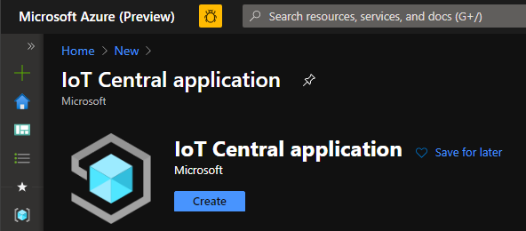

# OPC-UA to IoT Central QuickStart Guide

#### 0. Prerequisites

Before getting started, make sure you have [IoT Edge installed](https://docs.microsoft.com/en-us/azure/iot-edge/how-to-install-iot-edge-linux).  This is where all our Edge modules will run. In production this box will need network visibility to the OPC Server.

Also install the [IoT Edge Dev Tool](https://github.com/Azure/iotedgedev), or utilize the provided [VS Code Dev Container](https://code.visualstudio.com/docs/remote/containers).

#### 1. Create an IoT Central Application

From the [Azure Portal](https://portal.azure.com) create a new IoT Central Application.  To determine which type of plan to select please review the [different tiers](https://azure.microsoft.com/en-us/pricing/details/iot-central/).
azure-create-central.png.

#### 2. Generate a deployment manifest

Before we do anything else in IoT Central, we need to create an IoT Edge Deployment manifest.  This will become the basis for our Device Template inside of Central. In this repo you can find a [production deployment manifest _template_](./deployment.production.template.json) which will serve as the base and be rendered into a final deploymenmt manifest.

##### Settings

In this template there's a few options to note:

**`opcPublisher`**

In the production manifest template you'll notice that under the `opcPublisher` settings there is an option for `Binds`.  These are file paths we want to keep locally on the machine but also expose to the OPC Publisher container.  This is the folder where we'll need to place [`publishedNodes.json`](./modules/opcPublisher/publishedNodes.json) - our configuration for accessing our OPC server and what tags to collect.  By default this is set up to look at the `/opc` folder, but you can customize it to any local path you want.

**`opcToDtdl`**

Under the opcToDtdl section there are four environment varialbes you can configure:

 - `DefaultApplicationUri`: If your OPC server does not include an application uri this value will be filled in automatically
- `NodeIdRegex`: A regular expression to limit parts of the OPC Node ID returned.
- `ApplicationUriRegex`: : A regular expression to limit parts of the Application URI returned,

Each of these parameters is optional.

#### Generating the manifest

To generate the deployment manifest simply run: `iotedgedev genconfig -f deployment.production.template.json` and a manifest will output to the `config/` directory

#### 3. Construct a Device Template