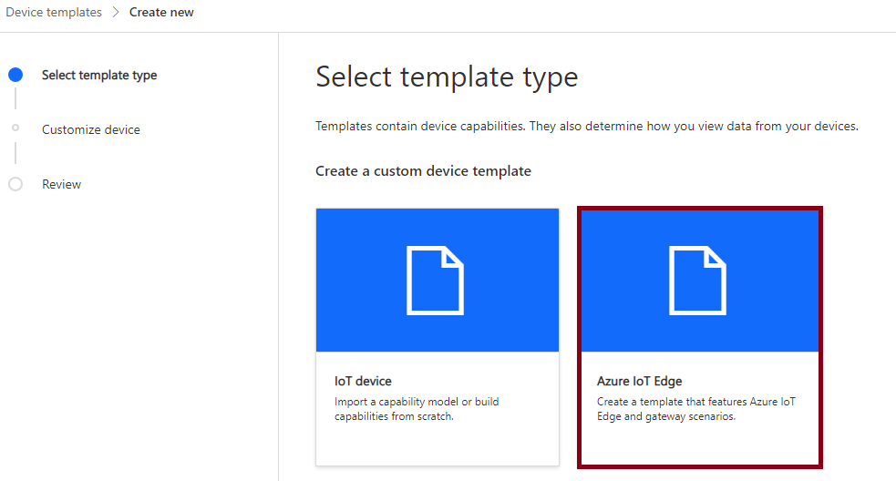
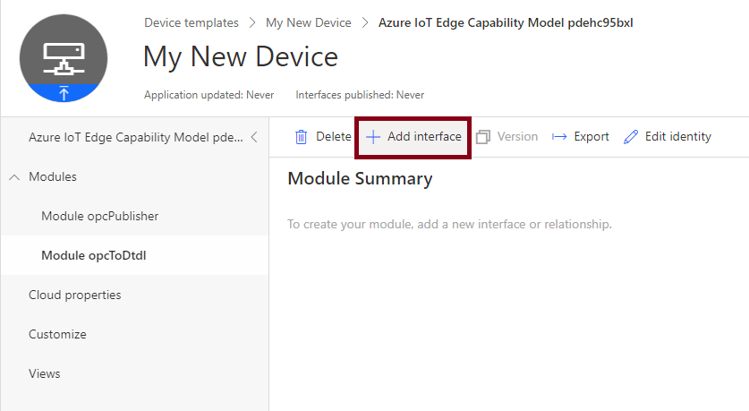
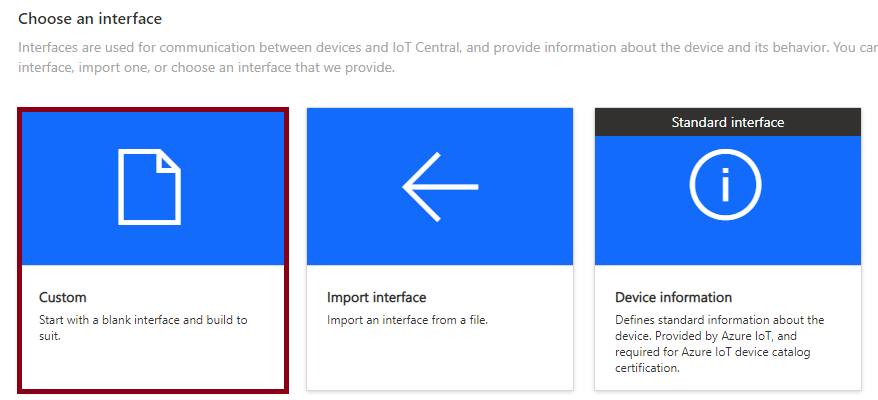
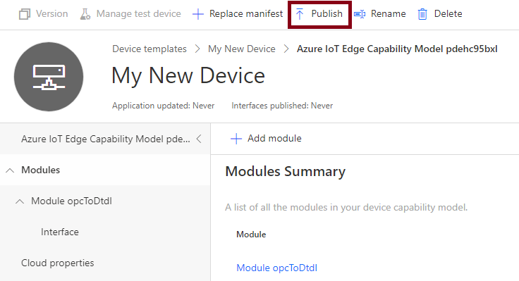
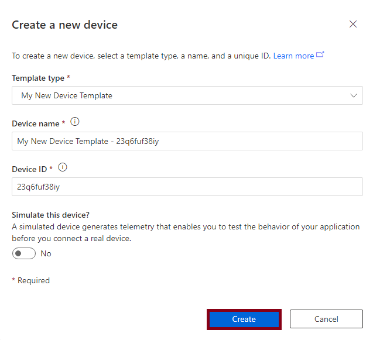

# OPC-UA to IoT Central QuickStart Guide

### 0. Prerequisites

Before getting started, make sure you have [IoT Edge installed](https://docs.microsoft.com/en-us/azure/iot-edge/how-to-install-iot-edge-linux).  This is where all our Edge modules will run. In production this box will need network visibility to the OPC Server.

Also install the [IoT Edge Dev Tool](https://github.com/Azure/iotedgedev), or utilize the provided [VS Code Dev Container](https://code.visualstudio.com/docs/remote/containers).

### 1. Create an IoT Central Application

From the [Azure Portal](https://portal.azure.com) create a new IoT Central Application.  To determine which type of plan to select please review the [different tiers](https://azure.microsoft.com/en-us/pricing/details/iot-central/).
azure-create-central.png.


### 2. Generate a deployment manifest

Before we do anything else in IoT Central, we need to create an IoT Edge Deployment manifest.  This will become the basis for our Device Template inside of Central. In this repo you can find a [production deployment manifest _template_](./deployment.production.template.json) which will serve as the base and be rendered into a final deploymenmt manifest.

##### Settings

In this template there's a few options to note:

###### `opcPublisher`

In the production manifest template you'll notice that under the `opcPublisher` settings there is an option for `Binds`.  These are file paths we want to keep locally on the machine but also expose to the OPC Publisher container.  This is the folder where we'll need to place [`publishedNodes.json`](./modules/opcPublisher/publishedNodes.json) - our configuration for accessing our OPC server and what tags to collect.  By default this is set up to look at the `/opc` folder, but you can customize it to any local path you want.


###### `opcToDtdl`

Under the opcToDtdl section there are four environment varialbes you can configure:

 - `DefaultApplicationUri`: If your OPC server does not include an application uri this value will be filled in automatically
- `NodeIdRegex`: A regular expression to limit parts of the OPC Node ID returned.
- `ApplicationUriRegex`: : A regular expression to limit parts of the Application URI returned,

Each of these parameters is optional.

#### Generating the manifest

To generate the deployment manifest simply run:

`iotedgedev genconfig -f deployment.production.template.json`

and a manifest will output to the `config/` directory

### 3. Construct a Device Template

Inside the IoT Central application Select "Device Templates" and choose IoT Edge:



On the customize page give your Device Template a name, and then choose your generated deployment manifest (which should be at `config/deployment.production.amd64.json`) to upload.  For this use case we _don't_ need to select "Gateway device with downstream devices" as this is pulling from OPC Devices not other IoT-Capable Device.

After reviewing click create to create your device template.

### 4. Remove the opcPublisher module definition

Since the only module that emits data to the cloud is the `opcToDtdl` module, we need first need to delete the `opcPublisher` module from the pre-created template.  IoT Central will keep the underlying deployment manifest the same (so the `opcPublisher` *will* deploy), but it serves no purpose in the Central template.


### 5. Configure the opcToDtdl Interface

Now choose the `opcToDtdl` module and choose add interface.  This is where we'll define what types of telemetry we expect to see in IoT Central.



In this case choose a custom interface:



Then add new Capabilities for each tag you want to be able to be displayed in IoT Central.  In this example I've used the ITEM_COUNT_GOOD tag from the OPC Simulator provided in the test deployment template.


### 6. Publish your device template

Once all capabilities have been added, choose Publish on the Device template menu.



### 7. Create a device

Now that your template has been published you can find it under the Devices menu.  Within here you can create a new device.



### 8. Connect your device

Under your new device choose the connect button to get your devices connection information.


This information can now be added to your IoT Edge Device configuration found on the device at `/etc/iotedge/config.yaml`

Simply uncomment the entry for DPS Symmetric Key and add the `scope_id`, `device_id` (where registration_id is), and `symmetric_key`.

```
# DPS symmetric key provisioning configuration
provisioning:
  source: "dps"
  global_endpoint: "https://global.azure-devices-provisioning.net"
  scope_id: "<SCOPE_ID>"
  attestation:
    method: "symmetric_key"
    registration_id: "<REGISTRATION_ID>"
    symmetric_key: "<SYMMETRIC_KEY>"
```

After that run `sudo iotedge restart` and your device should start to pull down containers and write data to IoT Central!